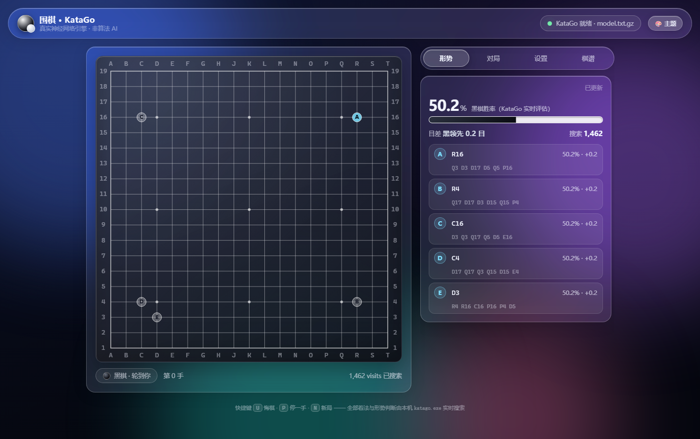

# 围棋 · KataGo 网页版

一个**玻璃拟态（Glassmorphism）**的围棋网页，AI 来自**你电脑上真实的 KataGo 引擎**：
浏览器通过本机 Node 桥接服务，用 GTP 协议驱动 `katago.exe`，每一手都是神经网络 + MCTS 搜索，
不是手写算法、也不是浏览器里跑弱化版模型。



## 先搞清楚一件事

```
浏览器（网页） ──HTTP + SSE──▶ server.js（本机桥接） ──GTP──▶ katago.exe
```

KataGo 引擎是 exe + 神经网络模型（几十 MB 起），**只能跑在你自己的电脑上**；
Cloudflare Pages、GitHub Pages 这类静态托管跑不了引擎。所以本仓库有两种用法：

| 用法 | 效果 |
| --- | --- |
| 🖥️ **本机使用（推荐）** | 双击 `启动围棋.cmd`（或 `start.vbs` 无窗口启动）→ 浏览器自动打开，AI 对局、实时胜率、形势热图全部可用 |
| 🌐 **部署到公网** | 把 `public/` 托管到 Cloudflare Pages → 得到一个免费域名；页面能打开、能当双人棋盘用；**要下 AI，需要在页面里填你电脑上引擎的地址**（做法见 [DEPLOY.md](DEPLOY.md)） |

## 本机使用

1. 安装 [Node.js](https://nodejs.org)（≥18）
2. 准备好 KataGo：`katago.exe` + 神经网络模型（`*.txt.gz`）+ 一份 `gtp` 配置
3. 双击 **`启动围棋.cmd`**（带窗口、能看日志），或者：

   ```bash
   node server.js
   ```

4. 浏览器打开 <http://127.0.0.1:3210/>

引擎路径通常不用手填：程序会自动在 `~/围棋AI`、`~/Desktop/围棋AI`、`~/Documents/围棋AI` 里找。
找不到就把 `engine.example.json` 复制成 `engine.json` 填上路径（该文件已在 `.gitignore` 里，不会提交）。

## 功能

- **人机对弈**：执黑 / 执白、9 / 13 / 19 路、中国规则 7.5 目（可切 6.5 / 0.5）
- **4 档棋力**：每手思考 1 / 2.5 / 5 / 12 秒（慢机器上按时间比按 visits 更可控）
- **让子**：2 / 3 / 4 / 5 / 9 子，用标准让子点，自动取消贴目
- **实时形势**：胜率条、目差、搜索量，全部来自引擎实时评估
- **推荐点**：KataGo 前 5 候选点（棋盘上标 A~E，附胜率与变化图）
- **形势热图**：`kata-analyze ... ownership true` 的领地归属图
- **对局操作**：悔棋、停一手、认输、双方停一手后 `final_score` 数子、导出 SGF、棋谱面板
- **右侧横向玻璃切换条**：形势 / 对局 / 设置 / 棋谱 四个功能区切换，胜率永远在第一屏
- **玻璃拟态 UI**：4 套主题、彩色光斑背景（跟随鼠标）、毛玻璃开关

## 配置 engine.json

| 字段 | 说明 |
| --- | --- |
| `port` | 服务端口，默认 `3210`（被占用会自动 +1） |
| `host` | 监听地址。默认 `127.0.0.1`（仅本机）；改成 `0.0.0.0` 可让局域网/手机访问 |
| `token` | 可选访问令牌。把引擎暴露到公网时**强烈建议设置**，页面里填同一个令牌才能连接 |
| `katago` / `model` / `config` | 引擎、模型、gtp 配置的绝对路径（留空则自动探测） |
| `numSearchThreads` | 搜索线程数，建议按 `katago benchmark` 的推荐值填 |
| `startupTimeoutMs` | 引擎启动（加载模型）超时时间 |

## HTTP 接口

供二次开发使用（浏览器与桥接服务之间）：

| 接口 | 作用 |
| --- | --- |
| `GET /api/status` | 引擎状态、路径、队列 |
| `GET /api/events` | SSE：`status` / `info`（实时分析帧） |
| `POST /api/newgame` | `{boardSize, komi, rules, handicap}` |
| `POST /api/sync` | 用整盘棋谱重放（悔棋 / 换边用） |
| `POST /api/play` | `{color, move}` |
| `POST /api/genmove` | `{color, seconds}` → 引擎走子 |
| `POST /api/analyze` | `{color, seconds, ownership}` → 分析 |
| `POST /api/score` | `final_score` 数子 |
| `POST /api/raw` | `{command}` 只读调试命令（如 `showboard`） |
| `POST /api/restart` | 重启引擎 |

跨域（CORS）已放开，所以静态托管的页面可以直连你电脑上的引擎。

## 目录结构

```
public/            静态页面（部署到 Cloudflare Pages 时，输出目录填它）
  index.html
  style.css
  app.js
  _headers         Cloudflare Pages 的响应头配置
server.js          本机桥接服务：GTP 协议栈 + SSE + 静态托管
engine.json        本机引擎配置（已 gitignore）
engine.example.json 配置模板
start.vbs          无窗口启动（桌面快捷方式指向它）
启动围棋.cmd        带窗口启动，能看日志
go.ico             图标
docs/              截图
DEPLOY.md          部署到 GitHub + Cloudflare Pages 的详细步骤
```

## 许可

MIT
